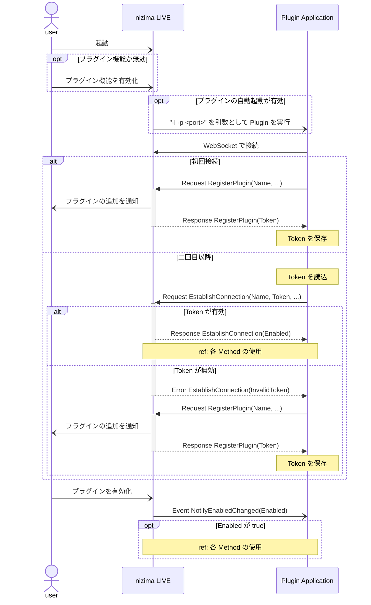
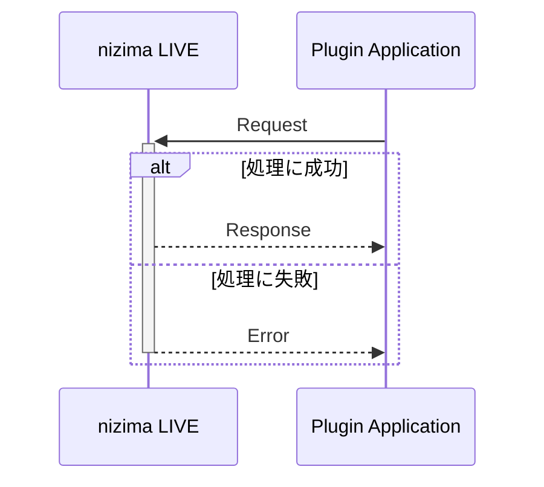
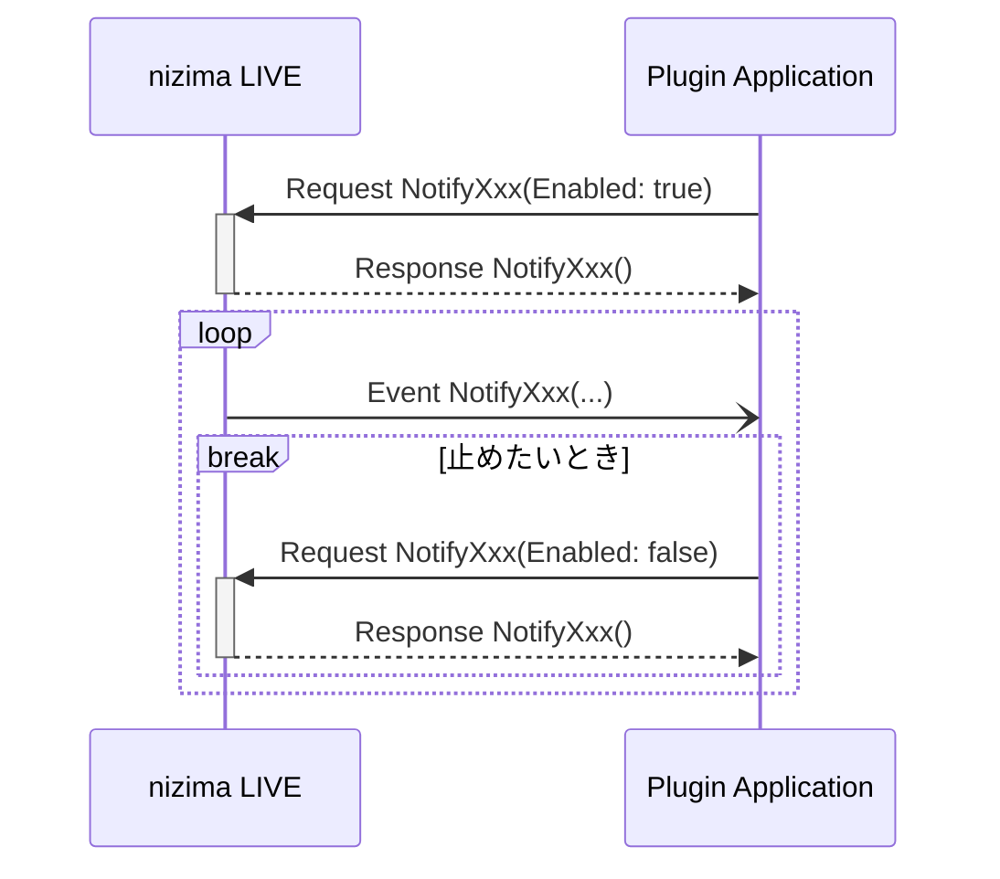

# サンプル
## [QML Sample](https://github.com/Live2D-Garage/nLPluginQmlSample)

Qt/C++ で作成されたシンプルなプラグイン。  
モデルの追加や削除などができる。  
MIT ライセンスの下で作成されているので開発のベースとして使用可能。

## [Mouse Extender](https://github.com/Live2D-Garage/nLPluginMouseExtender)

nizima LIVE の MouseX/MouseY をウィンドウ内座標からモニター座標に拡張するプラグイン。  
QML Sample をベースに作成した。  
nizima LIVE からの起動時にはバックグランドで動作する。

## [Prameter Preview](https://github.com/Live2D-Garage/nLPluginParameterPreview)

Web プラグインのサンプル。  
モデルのパラメータの現在値を表示できる。

# データ形式

nizima LIVE とプラグインがやり取りする際は、必ず以下の形式に沿った JSON を使用する。

型定義（TypeScript）

```tsx
{
  nLPlugin: string,
  Timestamp?: number,
  Id?: string,
  Type: "Request" | "Response" | "Event" | "Error",
  Method: string,
  Data?: any
}
```

具体例（JSON）

```json
{
  "nLPlugin": "1.0.0",
  "Timestamp": 1696233943287,
  "Id": "request13",
  "Type": "Request",
  "Method": "GetModelList",
  "Data": {}
}
```

| キー | 説明 |
| --- | --- |
| nLPlugin | nizima LIVE Plugin API のバージョンを指定する |
| Timestamp | 現在時刻のエポックミリ秒 |
| Id | Request で値を設定しておくと、対応する Response または Error に同じ値が入って返ってくる。Event では null |
| Type | メッセージの種類 |
| Method | 操作内容 |
| Data | Type と Method に応じた追加情報 |

これ以降では説明に必要な違いのある部分のみ記載し、共通の部分は省略されていることがある。

# 接続方法

接続には WebSocket を使用する。  
ローカルホスト限定で、リモートからは接続できない。  
URL は `ws://localhost:<port>/` で、port は nizima LIVE のプラグインマネージャーで確認できる。  
port のデフォルトは 22022 となっている。

## API 使用までの接続の流れ

以下に API が使用可能になるまでのシーケンス図を示す。  
通信内容の詳細な説明は後に続く。



## 初回接続

1. nizima LIVE を起動し、プラグイン機能を有効にする
2. WebSocket で nizima LIVE に接続
3. データ形式に沿って、以下のデータを送信する
    
    ```json
    {
      "Type": "Request",
      "Method": "RegisterPlugin",
      "Data": { "Name": "plugin name", "Developer": "your name" }
    }
    ```
    
    ここで送信する Data の内容は nizima LIVE のプラグインマネージャーの表示に使用される  
    ほかにも設定できる項目があるので、必要があれば [Method 一覧](methods.md) の RegisterPlugin を参照すること
    
4. nizima LIVE から以下のデータが返ってくる
    
    ```json
    {
      "Type": "Response",
      "Method": "RegisterPlugin",
      "Data": { "Token": "f2jm8ASDe3..." }
    }
    ```
    
    `Token` は二回目以降の接続に使用するので保存しておく
    
5. nizima LIVE で登録したプラグインを有効にする
6. 以下のイベントが来るのを待つ
    
    ```json
    {
      "Type": "Event",
      "Method": "NotifyEnabledChanged",
      "Data": { "Enabled": true }
    }
    ```
    
    `Data.Enabled` が `true` であれば各 Method の使用が可能
    

## 二回目以降の接続

1. WebSocket で nizima LIVE に接続
2. `RegisterPlugin` で登録した `Name` と取得した `Token` を用いて、以下のデータを送信する
    
    ```json
    {
      "Type": "Request",
      "Method": "EstablishConnection",
      "Data": {
        "Name": "plugin name",
        "Token": "f2jm8ASDe3..."
      }
    }
    ```
    
3. 応答を待つ
    - Error を受け取った場合
        
        ```json
        {
          "Type": "Error",
          "Method": "EstablishConnection",
          "Data": { "ErrorType": "InvalidToken" }
        }
        ```
        
        プラグインマネージャーから登録したプラグインを削除した場合は上記のエラーが返ってくる          
        このままでは API の使用ができないので、初回接続の手順で再度登録する
        
    - Response を受け取った場合
        
        ```json
        {
          "Type": "Request",
          "Method": "EstablishConnection",
          "Data": { "Enabled": false }
        }
        ```
        
        `Data.Enabled` が `true` であれば各 Method の使用が可能          
        `false` の場合は以下のイベントが来るのを待つ
        
        ```json
        {
          "Type": "Event",
          "Method": "NotifyEnabledChanged",
          "Data": { "Enabled": true }
        }
        ```

# 各 Method の使用

[Method 一覧](methods.md) に使用できる Method と説明が並べられている。  
操作したい内容にあった Method を使用して Request を送信することで、nizima LIVE で処理が行われる。  
処理が成功した場合は Response が、失敗した場合は Error が返ってくる。



<details>
<summary>具体例：特定のモデルの Cubism パラメータの現在値を取得したい場合</summary>

`ModelId` は `GetModels` などで取得したものを使用する。

```json
{
  "Type": "Request",
  "Method": "GetCubismParameterValues",
  "Data": { "ModelId": "1" }
}
```

を送信すると、

```json
{
  "Type": "Response",
  "Method": "GetCubismParameterValues",
  "Data": { "CubismParameterValues": [ { "Id": "ParamAngleX", "Value": 10.3 }, ... ] }
}
```

が返ってくる。`Data.CubismParameterValues` に各 Cubism パラメータの現在値が格納されている。

もし `ModelId` に一致するモデルが存在しなかった場合は

```json
{
  "Type": "Error",
  "Method": "GetCubismParameterValues",
  "Data": { "ErrorType": "InvalidModelId" }
}
```

が返ってくる。

</details>

## イベント系の Method

イベント系の Method の名前は主に Notify~ で始まる。  
一部のイベントを除き、使用するためにはイベントを有効にする必要がある。  
イベントの有効状態は nizima LIVE に保存されないので、毎回有効にする必要がある。



<details>
<summary>具体例：各フレームでのパラメータの値を取得したい場合</summary>

```json
{
  "Type": "Request",
  "Method": "NotifyFrameUpdated"
}
```

を送信すると、

```json
{
  "Type": "Response",
  "Method": "NotifyFrameUpdated"
}
```

が返ってきて、さらに nizima LIVE のフレームの更新ごとに

```json
{
  "Type": "Event",
  "Method": "NotifyFrameUpdated",
  "Data": {
    "Models": [ {
      "ModelId": "1",
      "LiveParameterValues": [...],
      "CubismParameterValues": [...]
    }, ...]
  }
}
```

が nizima LIVE から送信されるようになる。

止めたい場合は以下を送信する。

```json
{
  "Type": "Request",
  "Method": "NotifyFrameUpdated",
  "Data": { "Enabled": false }
}
```

</details>

## 用語集

Method の説明で使用される用語の説明

| 用語 | 説明 |
| --- | --- |
| LiveParameter | 入力パラメータ<br>トラッキングやリップシンクなどで設定される値 |
| CubismParameter | Live2D モデルのパラメータ |
| Scene | 各ウィンドウに一つずつある<br>モデルやアイテムが属している |
| Model | 画面上に読み込まれているモデル |
| Item | 画面上に読み込まれているアイテム |
| RegisteredModel | モデル一覧に登録されているモデル |
| RegisteredItem | アイテム一覧に登録されているアイテム |

# API 詳細

API を用いてどのようなことができるかは、[Method 一覧](methods.md) を参照すること。  
ここでは [Method 一覧](methods.md) の見方について解説する。

- Xxx Data Type
    - それぞれ Request・Response・Event における Data の型を示す
    - 空の場合は `{}` と表記し、それ以外の場合は外側の `{}` は省略している
    - Request Data Type がある場合、Request を送信して Response を受信することができる
    - Event Data Type がある場合、Event を受信することができる
        - Event Data Type と Request Data Type の両方がある場合、Request を送信することで Event を有効にすることができる
- Error Types
    - 以下にある一般のエラー以外に発生し得るエラーを示す
        - InvalidPluginName
        - InvalidToken
        - InvalidApi
        - InvalidType
        - InvalidMethod
        - UnsupportedVersion
        - PluginDisabled
        - NotImplemented

<details>
<summary>具体例1：現在選択されているモデルの ModelId を取得したい場合</summary>

`GetCurrentModelId` を見ると、以下のようになっている。

### Request Data Type
```typescript
{}
```
### Response Data Type
```typescript
SceneId: string,
ModelId: string
```

Request Data Type が `{}` であることから、`Data` を空とした以下の JSON を送信する。

```json
{
  "nLPlugin": "1.0.0",
  "Timestamp": 1696233943287,
  "Id": "request1",
  "Type": "Request",
  "Method": "GetCurrentModelId",
  "Data": {}
}
```

これを送信すると、Response Data Type と同じ型の `Data` を持つ Response が返ってくるので、`Data.ModelId` を読み出すことで取得できる。

```json
{
  "nLPlugin": "1.0.0",
  "Timestamp": 1696233943531,
  "Id": "request1",
  "Type": "Response",
  "Method": "GetCurrentModelId",
  "Data": {
    "SceneId": "0",
    "ModelId": "1"
  }
}
```
</details>

<details>
<summary>具体例2：モデルが選択されたとき、選択されているモデルの ModelId を取得したい場合</summary>

`NotifyCurrentModelChanged` を見ると、以下のようになっている。

### Request Data Type
```typescript
Enabled?: boolean
```
### Response Data Type
```typescript
{}
```
### Event Data Type
```typescript
ModelId: string
```

まずはイベントを有効にするために、Request Data Type に沿った `Data` で Request を送信する。

```json
{
  "nLPlugin": "1.0.0",
  "Timestamp": 1696233949432,
  "Id": "request2",
  "Type": "Request",
  "Method": "NotifyCurrentModelChanged",
  "Data": { "Enabled": true }
}
```

イベントが有効になると、以下の Response が返ってくる。

```json
{
  "nLPlugin": "1.0.0",
  "Timestamp": 1696233949626,
  "Id": "request2",
  "Type": "Response",
  "Method": "GetCurrentModelId",
  "Data": {}
}
```

その後、nizima LIVE でモデルが選択されると、Event Data Type と同じ型の `Data` を持つ Event を受け取ることができる。

```json
{
  "nLPlugin": "1.0.0",
  "Timestamp": 1696233951345,
  "Type": "Event",
  "Method": "GetCurrentModelId",
  "Data": { "ModelId": "2" }
}
```

イベントの受信を止めたい場合は以下を送信する。

```json
{
  "nLPlugin": "1.0.0",
  "Timestamp": 1696233965395,
  "Id": "request3",
  "Type": "Request",
  "Method": "NotifyCurrentModelChanged",
  "Data": { "Enabled": false }
}
```

</details>

# バージョン
バージョンは [セマンティックバージョニング 2.0.0](https://semver.org/lang/ja/) に従う。

## バージョンの変更

### メジャーバージョン

互換性が切れる変更の時に上げる

### マイナーバージョン

新しい Method が追加されるときに上げる

### パッチバージョン

Data の内容が追加されるときに上げる

## 互換性

| nizima LIVE \ Plugin | 1.0.0 | 1.0.1 | 1.1.0 | 2.0.0 |
| --- | --- | --- | --- | --- |
| 1.0.0 | OK | OK *1 | OK *1 *2 | Error |
| 1.0.1 | OK | OK | OK *1 *2 | Error |
| 1.1.0 | OK | OK | OK | Error |
| 2.0.0 | Error | Error | Error | OK |

*1: 非対応の Data が取得できなかったり無視されたりする

*2: 非対応の Method は使用できない

## 変更履歴
### 1.0.0
初回リリース